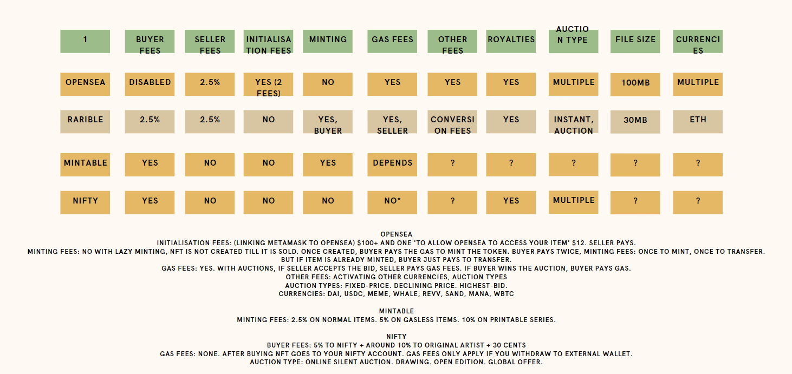

# Welcome to 123NFT!
Minting NFTs as easy as 1, 2, 3.  

Presented by Alisha Geary, Kevin Zhao, James Sheridan, Kai Ooi

## Motivation

We wanted to make creating NFTs as easy as 1, 2, 3 by taking all the complicated programming work out of the equation. Seamless, transparent, and as open as possible.  

We have a 3 step process:
1. Sign up to 123NFT & Pinata
2. Upload content to Pinata, copy 'CID' key.
3. Return to 123NFT & Mint.

Sell it, trade it, frame it, you name it!

## Signing up to 123NFT

Visit our website, sign up as a new user.

## Uploading content to Pinata and 123NFT
Minting an NFT represents ownership of a digital asset (Digital Art, Collectibles, Games, Music, Film, Memes, Sports, Fashion, Academia etc). This digital asset needs to be stored somewhere on the web.  

Most NFT platforms have either some sort of centralised server running 24/7, or they use IPFS (InterPlenetary File System) (1). IPFS is a protocol and peer-to-peer network for storing and sharing data in a distributed file system. (2)  

123NFT user content is stored in Pinata, which is an IPFS pinning service for platforms, creators, and collectors. (3)  
On Pinata, users will be able to add their content which will then be stored in the decentralised web. Pinata provides users with a 'CID' or 'hash'. This 'hash' is the link between the actual content and the NFT. The hash is then copied into our 123NFT platform, attributes of the NFT added, and then it is ready to be minted.  
Any IPFS server could be used, it does not have to be Pinata.

A Web3 wallet is also needed. Metamask is preferred. (4)

## File size limits

Pinata offers 1000 MB of free storage. To store a large sized digital asset for example a 4K video clip, you may incur storage costs in the form of a fixed fee per month. If payment is halted, the link to the NFT will be broken, and access restricted. This issue is called 'broken links. (5)

## Cost

Each Ethereum transaction requires computational resources to execute, each transaction requires a fee. Gas refers to the fee required to successfully conduct a transaction on Ethereum, and is paid in Ethereum's native currency, ether (ETH).

Minting fee: Gas fees paid by minter (seller)  
Transfer fees: Buyer pays cost of NFT + $1 (in wei) to 123NFT + Royalties to original minter. Gas fee paid by seller
Initialisation fees: None  
Royalties: Fixed amount of ETH to original minter dependent on initial contract.  
Auction Types: Fixed price, auction  
Currencies supported: ETH  
File Size Limit: Dependent on IPFS storage  

## Selling/Transferring the NFT

See 'transfer fees' as above.  
In a fixed priced sale, the buyer of the NFT will pay the asking price of the NFT. $1 of sale proceeds go to 123NFT, a fixed predetermined amount goes to the original minter as a royalty. Transferring the NFT out to a private wallet like Metamask will incur gas fees paid by the seller.

## Why minting on our platform is better than the rest  

1. We do not have initialisation fees.
2. We do not charge for minting, sellers only have to pay on-chain gas fees.
3. Royalties are guaranteed to the original minter, based on our solidity contract. This is automatic and unhackable. Unlike other platforms which utilise a more centralised frontend system to handle the royalties. 
4. When buyers buy an NFT, they get control of the contract and token. Unlike sites like Nifty, which do not give the buyer immediate access to the NFT.

## Data Collection
 (6, 7, 8, 9, 10)  

## Limitations & Problems faced
1. Getting cheap decentralised file storage. Pinata has a limit of 1000MB.
2. Canva vs Github pages. Websites created on Canva do not render correctly on Github pages. Decision was made to stick with Canva.
3. Creating code which makes it a seamless user experience from start to finish. Creating a 123NFT account, uploading content to IPFS, minting the NFT. Finding Solidity code which would let us (the creators) have a cut of profit.
4. Linking the backend to the front end smoothly. User experience needs to be as seamless as possible.
5. Deciding on the business model of 123NFT. The biggest NFT marketplaces Opensea, Rarible, Mintable & Nifty all have different business models. As seen above, fees and charges vary wildly. The ability to mint an NFT, as opposed to just selling it varies too.

## Future thoughts:  
1. Incorporation with gaming companies, allowing players to automatically capture a snippet and mint an NFT.  
2. Do we have to code on the Ethereum blockchain? Ethereum is no doubt a giant in the cryptocurrency space, and has a first mover advantage in smart contracts. However gas prices are high, and there is controversy towards their carbon footprint/enviromental impact.  
Solutions would be to write smart contracts/mint NFTs on layer 2 on Ethereum (Polygon or Immutable network) (11), or use a totally separate blockchain (Vechain, Algorand, Cardano, Solana, Tezos etc).  
Ethereum is a low risk blockchain. Choosing an alternative better, faster, cheaper blockchain would solve our scaling problems. However it is higher risk as whether the blockchain succeeds, and in extension whether 123NFTs succeeds. There needs to be an active marketplace for buyers and sellers. Whichever network is chosen, one needs to ensure the longevity of the blockchain over the next few years.  
Lesser known NFT marketplaces are shown here:  
https://www.hicetnunc.xyz/ is built on the Tezos blockchain.  
https://litemint.com/ is built on the Stellar blockchain.
3. 123NFT might choose to have our own goverance token, similar to how Rarible has it's own RARI token. This moves towards being a fully Decentralised Autonomous Organisation (DAO), where platform users have decision rights and voting requires staking tokens for a specific period. (12)
4. With regards to hosting our content, we are currently using the Pinata IPFS File Management. We could adopt 'Filecoin'(13), which is an open-source, public cryptocurrency and digital payment system intended to be a blockchain-based cooperative digital storage and data retrieval method. It is made by Protocol Labs and builds on top of InterPlanetary File System, allowing users to rent unused hard drive space.  

## Conclusion
Cryptocurrency + Blockchain is the future. NFTs represent one part of that future. Very interesting times ahead.

## 123NFT App
Click [here](https://www.canva.com/design/DAEk6H9YhQs/HtZeNvjY-JHv032EdALqYQ/view) to launch the 123NFT! application.  
Website was created with Canva. Images were either from Canva or Pexel, royalty free.

## Links:  
1. https://ipfs.io/  
2. https://en.wikipedia.org/wiki/InterPlanetary_File_System  
3. https://pinata.cloud/  
4. https://metamask.io/
5. https://en.wikipedia.org/wiki/Link_rot
6. https://opensea.io/blog/guides/7-reasons-to-sell-your-nfts-on-opensea/
7. https://medium.com/cryptogeum/how-to-mint-an-nft-on-opensea-f46725a41e1d#:~:text=OpenSea%20doesn't%20charge%20you,on%20resales%20of%20your%20NFTs.  
8. https://thecollegeinvestor.com/36849/rarible-review/
9. https://www.reddit.com/r/NiftyGateway/comments/m3myhv/nifty_gateway_gas_fees_and_when_you_get_charged/
10. https://www.youtube.com/watch?v=ny7QcnVeDVw
11. https://www.immutable.com/
12. https://www.daytrading.com/rarible#:~:text=NFT%20features-,Fees,only%20charges%202.5%25%20in%20commission.
13. https://en.wikipedia.org/wiki/Filecoin