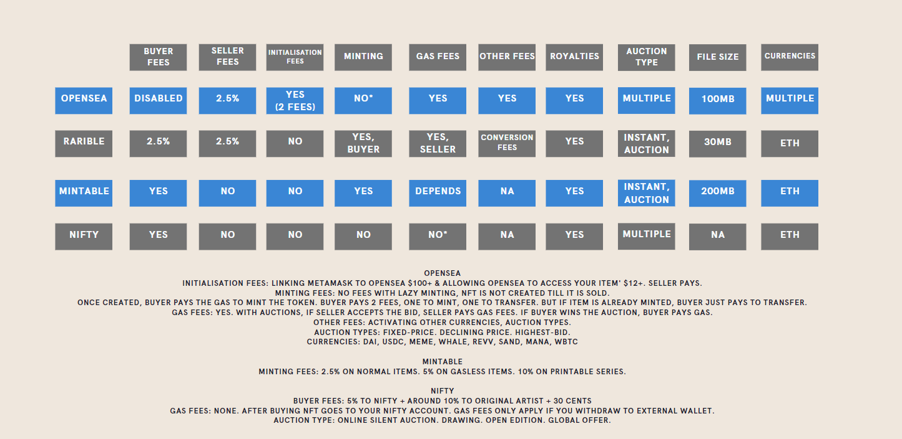

# Welcome to 123NFT!
Minting NFTs as easy as 1, 2, 3.  

Presented by Alisha Geary, Kevin Zhao, James Sheridan, Kai Ooi

## Motivation

We wanted to make creating NFTs as easy as 1, 2, 3 by taking all the complicated programming work OUT of the equation for users. All new users to our platform would have to do is insert their content, provide pinata API keys and mint their NFTs. Sell it, trade it, frame it, you name it!

What is pinata API keys???

Pinata is where your NFT will live. Below, you will be able to add your content (photo, video, soundtrack etc.) and you will receive:
A public key
A secret key
You will need to store these in a safe place as they are the keys that unlock your NFT!

Pinata is a file storage system that keeps your files safe but it is up to you to keep your keys to the safe...safe!

## Cost

What’s the cost?

As you know, everything to do with the blockchain will cost some moolah. As we are using Ethereum, it will cost some ETH (currency used on Ethereum). You will need to install an application called Metamask which will allow you to have your NFT stored on the blockchain. To use our service of doing it the easiest way will cost you $1. 

Surely there are more costs…

Depending on how big your content is that you’re turning into an NFT, you may incur some storage costs by Pinata. We can handle that but we will need you to chip in as we aren’t any Jeff Bezos’. If your content reaches a certain size, we will charge you a fixed fee per month which will happen without you having to do anything further. If you can’t pay, we will have to restrict your access to the NFT and we don’t want to do that. If you can, all’s well and we will get along just fine!

What happens if I want to sell my NFT to someone else?

Not a biggie. You will just need to notify us and we will change the owner of the NFT for you. A small fee would be charged for the transfer and we advise including this fee in your sale price to pass the fee onto your buyer!

# Data Collection

To begin, you will need:
Your content
Pinata (https://pinata.cloud/pinmanager)
Metamask (https://metamask.io/)
123NFT

Website was created with Canva.  
html file updated in frontend/index.html
Images in website were either from Canva or Pexel, royalty free images.

(Link to open sea URL, medium how to mint NFT)  
Need to tidy up the table
  

# Lmitations

Decentralised file storage systems?  
Pinata  
Filecoin

# Problems faced
1. Getting cheap decentrlaised file storage
2. Creating code which makes everything seamless

# Future thoughts:  
1. Incorporation with gaming companies, allowing players to automatically capture a snippet and mint an NFT.  
2. Do we have to stay with the Ethereum blockchain? Ethereum is no doubt a giant in the cryptocurrency space, and has a first mover advantage in the smart contract area. However gas prices are high, and there is controversy towards their carbon footprint/enviromental impact.  
Solutions would be to write smart contracts/mint NFTs on layer 2 on Ethereum (Polygon or Immutable network), or use a totally separate blockchain (Vechain, Algorand, Cardano, Solana, Tezos etc).  
Ethereum is a low risk blockchain. Choosing an alternative better, faster, cheaper blockchain would solve our scaling problems. However it is higher risk as whether the blockchain succeeds, and in extension whether 123NFTs success, depends on whether there is an active marketplace for buyers and sellers. Whichever network is chosen, one needs to ensure the longevity of the blockchain over the next few years.  
https://www.hicetnunc.xyz/ is built on the Tezos blockchain.  
https://litemint.com/ is built on the Stellar blockchain.
3. 123NFT might choose to have our own goverance token, similar to how Rarible has it's own RARI token. This moves towards being a fully Decentralised Autonomous Organisation (DAO), where platform users have decision rights and voting requires staking tokens for a specific period. (Link to daytrading website)

# Conclusion
Add in something here

# 123NFT App

Click [here](https://tokenaussie.github.io/123NFT/frontend/index.html) to launch the 123NFT! application.

# Links:  
https://opensea.io/blog/guides/7-reasons-to-sell-your-nfts-on-opensea/
https://www.daytrading.com/rarible#:~:text=NFT%20features-,Fees,only%20charges%202.5%25%20in%20commission.
https://medium.com/cryptogeum/how-to-mint-an-nft-on-opensea-f46725a41e1d#:~:text=OpenSea%20doesn't%20charge%20you,on%20resales%20of%20your%20NFTs.  
https://thecollegeinvestor.com/36849/rarible-review/
https://www.reddit.com/r/NiftyGateway/comments/m3myhv/nifty_gateway_gas_fees_and_when_you_get_charged/
https://www.immutable.com/
https://www.youtube.com/watch?v=ny7QcnVeDVw